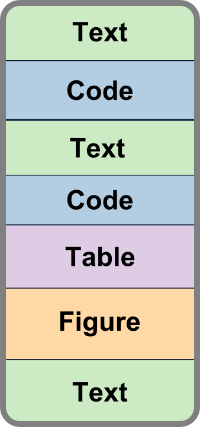

# Overview

This chapter provides a short overview of the Software R and RStudio and how to install both open-source software products.

This chapter presents both products in separate sections. It is however useful
to conceptualise R as the engine which will be operated through the RStudio interface.
In that respect, for this document, the separation between R and RStudio blurrs.

Readers intending to perform ANS performance analyses with the help of the functions
presented are requested to install R and RStudio.

The chapter closes with some basic operations.

# Software R

## Introduction to R

R is a free and open source software environment for data manipulation, calculation, statistical computing and visualisation[@RCoreTeam_2013].  The concept behind R can be traced back to the S language developed at Bell Laboratories. R provides a wide variety of out-of-the-box statistical functions and has a rich set of graphical features. 

The [R-project](http://www.r-project.org) maintains the software environment.

One of the key features of R is the package system. 
The base software functionality can be extended with dedicated libraries.
The number of packages is constantly growing. 
These extensions allow to carry out a wide range of data analysis tasks ranging
from data cleaning and transformation to highly specialised analyses (e.g. 
additive models, linear and non-linear models).

This capability is at the heart of this project.
Being an open source software R provides rich set of base functionality for
data transformation, analysis, and visualisation.

This lends itself to analysing ANS performance and developing tools to support
the analysis.

Similar to other software, R has a learning curve

## Installation of R

The installation of R is straightforward.
R can be downloaded for the common operating systems on CRAN, the [Comprehensive
R Archive Network]().

1. create a folder on your computer where you have write privileges, e.g. 
`C:/R`.
1. go to [R-project](http://www.r-project.org) and choose download and select your preferred mirror, or go directly to  [CRAN](https://cran.r-project.org/mirrors.html) and choose your preferred mirror
1. choose your operating system and select the **base** download, e.g. Download R 3.2.2 for Windows

1. download the R installer into the folder you crated in step 1
1. execute the installer and make sure that the version is installed in a sub-folder of your R-folder
1. it is safe to acknowledge all default settings of the installer    
`Note: if you do not have administrator priviledges, the installer will inform you that you cannot not associate R files with R. That is not an issue.`

## First Steps in R

Let's start R. 
If you had not deselected the option 'create icons on desktop' during the installation, you will find two icons on your desktop. One for the 32 bit and one for the 64 bit version.
If you had deselected the creation of the icons, 

1. browse to the sub-folder you installed R to, e.g. C:/R/R3.2.2
1. go to the folder bin
1. choose x64 for the 64 bit version
1. double click on R

R starts in a console window as shown in the following graph.


 
The welcome message informs you about the R version and provide pointers to some initial functions, e.g. 

* help() to launch the help pages
* q() to close R.

If you like, Key in help() to launch the help pages in a browser.

Now let's use R as a basic calculator.

* key in 5 * 4 to verify that the result is 20

Next we want to store a variable and plot a function.

1. store a sequence of numbers in a vector x.    
Key in x <- seq(1, 10, 0.1)   
This creates a sequence of numbers from 1 to 10 in increments of 0.1
1. you can verify the input by calling the vector x    
Key in x
1. next we will plot the sinus of x
key in plot(sin(x))
1. this opens another so-called graphic device windownand shows the sinus function.

We stop here with the introduction to R, as we will work primarily in RStudio.

Feel free to explore the R material listed below.

## Useful R Resources

The [R-project](http://www.r-project.org) offers useful material.
Further material on R can be found on the web ranging from written R documentation
and tutorials, worked examples, to youtube sessions on all aspects of R.

The following material might be useful to consider for getting a first feel
for the R language (and environment):

* *A (very) short introduction to R* is a great [paper](https://github.com/ClaudiaBrauer/A-very-short-introduction-to-R/blob/master/documents/A%20(very)%20short%20introduction%20to%20R.pdf) by Paul Torfs and Claudia Brauer [-@TorfsBrauer_2015].
It can serve as a 12-page crash course into R (and RStudio).
* *An introduction to R* [@Venables_RIntro_2015] is a comprehensive guide to R.

It is probably impossible to capture R in one singel book. 
For those that are interested in learning R itself, Matloff [-@Matloff_2011] is a 
recommended book. The book provides a multitude of examples about how R works and
how to use it.

# Software RStudio

## Introduction to RStudio

RStudio provides an integrated development environment for R and offers scripting style support for the conduct of data analyses. 

## Installation of RStudio

The installation of RStudio is also straightforward.
RStudio can be downloaded for the common operating systems from [RStudio](http://www.rstudio.com).

Download the open source desktop edition into a folder on your drive, e.g. 'C:/RStudio', execute the downloaded installer.

If you do not have adminstrative priviledges on your computer, download the zip/tarball and unzip the file in a folder, e.g. C:/RStudio

1. create a folder on your computer where you have write privileges, e.g. `C:/R`.

## First Steps in RStudio

After the installation launch RStudio.

RStudio organises the workspace in four areas. 
If you start RStudio for the first time it is possible that the top left pane is not shown. 
Just click the new file button in the top bar and select new R Script.


This will open the fourth pane.


Note: you are able to change the default order of panes in Settings >> Preferences >> Pane Layout.

### Editor

The editor is a basic text editor and allows to write R code or Rmd documents.

It comes with some value added features like line numbering, code roll-up, etc.

At the top, you will find a series of shortcuts, e.g. save file (disk symbol),
spell checker (ABC symbol), find/replace (magnifying glass symbol), etc.

Dependent on the file type, this set of shortcuts changes.

### Console

The console allows to run R commands directly. This supports interactive programming / access to the data, development and testing of functions, graphing, etc.

The interactive access is one of the key differentiating features of R and supports the development of ideas, testing, etc.

It is important to realise that code fragments from the editor can be pasted here to be executed.

### Environment / History

*Environment* is the R term for "working memory". THe environment will list all objects, including vectors, data sets, that are loaded into the memory. 

The environment gives a short description of the object and supports an inspection of the object content.

*History* stores the sequence of commands exectuted in the console. This history of commands can be saved into the .Rhistory file upon quitting RStudio (if you choose the save history option). 

### Miscellaneous

This panel supports multiple functions / features that can be accessed via the tabs.

* *Files* shows the files in the current directory and supports navigating the file system.

* *Plots* shows any plot called by the executed code. This is primarily to inspect the graphic while coding or performing an analysis.
You can zoom in on a plot or export it (save on disk).

* *Help* integrates the help pages.

* *Packages* lets you view and install (and update) additional packages into R.

* *Viewer* is a RStudio built-in browser to validate web-applications that you built with RStudio.

## Useful Resources

The internet is the best resource for all questions surrounding RStudio.


# RMarkdown

## Introduction to RMarkdown

RMarkdown is a file format for making dynamic documents with R. 
An R Markdown document is written in markdown. 
The key feature of markdown is that it uses an easy-to-write plain text format.
The benefit of this is that documents (which are simple text files) can also be read without requiring specific output software or training on interpreting the markup.

For example '#' is the symbol for a top level heading, '##' is a 2nd level headline.

RMarkdown allows to mix different elements in the body of the document: 

* plain text
* code, in particular R code
* tables, 
* and figures. 

These elements are "knit" together when rendering the output format.
Similar to weaving/knitting, the document is put together by combining the different parts. 
Below you can see the general idea of the document structure:



To separate code from text, knitr markdown uses chunks:   
'```{r}' indicates the start of a chunk while   
'```' indicates the end.   

To work nicely with RStudio you also need to remember to save your file with a .Rmd file ending.

## First Steps with a RMarkdown Document

Rstudio makes it easy to create a RMarkdown file and output it!

1. select File >> New File >> R Markdown

> if you create a RMarkdown for the first time RStudio will inform you that additional packages need to be loaded. Acknowledge this with OK.

1. complete the creation dialogue by inserting an appropriate title and author name.
This can be changed later when working on the document. 
1. choose the default output format. 
This can also be changed when working on the document. 
1. confirm with OK.

Rstudio creates a *dummy* RMarkdown document. This document comes with 

* a * YAML* header part that defines basic parameters,
* a few paragraphs of text, 
* and code chunks.

Feel free to add text or change a few lines of the text given.

Now let's create our first document:  
In the top bar of the editor window select 'knit HTML'. 
This renders the content of the editor (aka our file) into a html page.
The RStudio browser opens and let you preview your output.

Congrats! You have knitted your first Rmd document.

Feel free to explore the output of 'knit Word' and/or 'knit PDF'.

# Basic Operations

The very basic example above demonstrated how R can be used as a calculator.
The console allows to directly interact with R (and the loaded packages).

The following examples are coded making use of the Rmd feature to combine text
and code(-chunks) in a document. 
The code will be highlighted with a grey background.
The console output will have the form of '## [1] result of operation'.
If the output is a graphic, the figure will be plotted.

You are encouraged to key in the operations in the console to reproduce the results.

## Calculator Revisited

```{r ex1}
10^2 + 36
```

You can assign values to variable names. R will assign a basic type to the created object. 
The assignment operator is '<-'.

```{r ex2}
a <- 1
b <- 2
```

This will create two objects in the Environment (check upper right pane).
You can query these objects and perform operations on them.
An object is queried by calling its name.

```{r ex3}
a
```

The square bracket notation of the output, indicates this is the first line of the object. As it comes with one value only, it is a 1 x 1 vector.

Let's calculate the sum of squares for a and b:

```{r ex4}
csquare <- a^2 + b^2
csquare
```

and further the squareroot of csquare

```{r ex5}
sqrt(csquare)
```

## Utility Functions for the Environment

R offers a huge number of mathematical functions which we will not further explore here.
However, R offers also functions to allow for interactive data analysis and 
operations on the data.

One of the fundamental functions to inspect a dataobject is the *str()* function.

```{r ex6}
str(a)
```

Dependent on the object type, str() give a short summary of the object.
In our simple case: a is a numeric type of value 1.

To delete or remove an object from the environment, use the remove rm() function.
Obviously, if we remove an object, we can no longer query it.

```{r ex7}
rm(a)
```

To list the working memory, use ls(). This gives a list of the names of all objects.

```{r ex8}
ls()
```

We can remove/delete several objects by listing them, e.g. 'rm(b, csquare)'.
If we want to delete all objects, we can pass the listing to a list as the parameter of the rm() function.

```{r ex9}
rm(list = ls())
```

## Functions in General and Help

R offers a myriad of functions which may be tailorable with parameters.
With the help function one can access the help pages that explain the use of a specific function.

The help function is either called by '?functionname' or 'help(functionname)'.
For example

```{r ex10}
?mean
```

will open the help pages for the arithmetic mean function. 
An interesting interesting option is the 'na.rm' parameter. 
It defines whether NA values should be ignored when calculating the mean.

NA values are the R representation for empty (not available) values.

Let's create a vector of several (integer) measurements. One measurement is not available (e.g. missing data or noisy data). 
We can create a vector of combined values with the c() function.

```{r ex11}
measurements <- c(1, 2, 4, NA, 7, 5)
str(measurements)
mean(measurements)
mean(measurements, na.rm = TRUE)
```

If we do no define na.rm (default is FALSE, c.f. help pages), the function mean cannot be computed. 
The result is in itself a NA.

With 'na.rm=TRUE' the non-defined values are ignored and 'mean(measurements, na.rm = TRUE)' yields '(1 + 2 + 4 + 7 + 5)/5 = 3.8'

Feel free to experiment with other out-of-the box functions, e.g. 

* sum()
* min() and max()
* median(), fivenum()

## Vectorised Operations

As mentioned above, a single value is represented as a 1 x 1 vector in R.
We have also seen that 'x <- c(1, 2, 4, NA, 7, 5)' creates a 1 x 6 vector.

Operations on objects are generally vectorised. Let's explore this principle:

```{r ex12}
a <- 3
a + 2
x <- c(1, 2, 4, NA, 7, 5) 
x + 2
x * 3
```

We can see that the additive factor 2 is added to each element and the 
multiplication is performed on each element.

Let's create another vector and perform these operations on the vectors.

```{r ex13}
y <- c(3, 3, 2, 5, 6, 0)
x + y
x * y
```

Note: These examples are performed on equally dimensioned vectors.
R uses a replication rule to match differing length of vectors. 
In fact in 'x + 2', the 1 x 1 vector 2 was replicated to form a 1 x 6 vector.
Conversely, if we truncate y to its first 4 elements, i.e. 'y <- c(3,3,2,5)' it will be replicated to form a 1 x 6 vector, i.e. 'y <- c(3,3,2,5,3,3), for the operation with x.

## Data Structures and Data Types

There are four basic data structures in R:

* *vector* as introduced above comprises a 1-to-n element structure of the same data type;
* *matrix* is a multi-column n x m structure of the same data type;
* *data frame* is a generalised n x m structure of different data types per variable; and
* *list* requires no shared propoerty of the elements and can contain different dimensioned and types of objects.

We will primarily work with *data frames* which can be interpreted as a tabular data structure of measurements (e.g. flight movements) in which each variable is of a specific type.

R comes with some primitive data types:

* *numeric* a general purpose data type
* *integer*
* *character* any text representation of lenght 1 to n (i.e. string)

It is important to understand that R coerces the object (and output of functions) in a least restrictive way. I refer to this as *silent coercion*.
For example:

```{r ex14}
vec1 <- c(1, 2, 3, 4)
vec2 <- c(1, "2", 3, 4)
str(vec1)
str(vec2)
```

In 'vec2' the 2nd element is a character of value 2. 
Constructing the vector coerces the other numeric values also to characters.
'str(vec2)' reveals that vec2 is a character vector of 4 elements.

It follows that mathematical operations like 'sum(vec2)' will throw an error, as this function requires a numerical input.

Other data types are

* dates and timestamps
* plot objects with specific attributes
* output from specific functions may define similar to plots various attributes

## Data Frames

Next to *vectors* this guide addresses the analysis of performance data organised as *data frames*.
As introduced above, a *data frame* is a tabular (n x m) data structure.

This structure can be conceptualised as a table of measurements in which

* each row is a measurement
* each column is a variable of a specific data type.

# References
