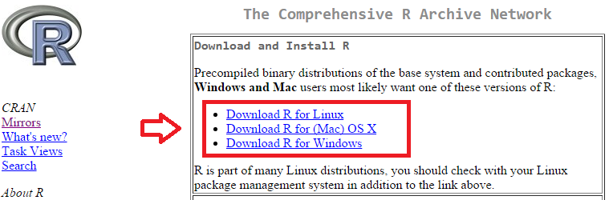
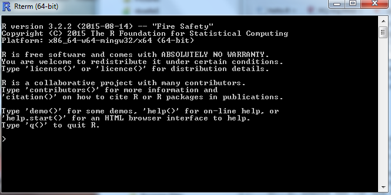
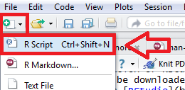
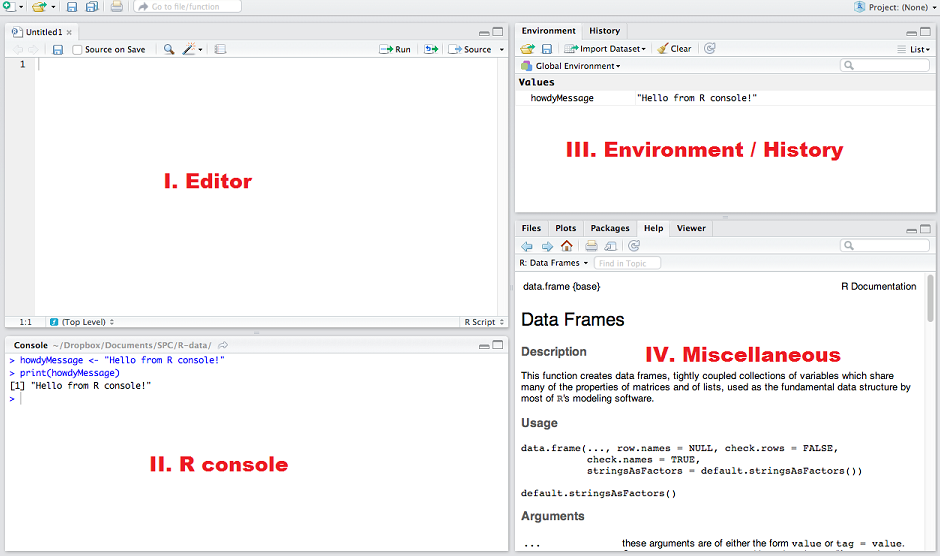

# Overview

This chapter provides a short overview of the Software R and RStudio and how to install both open-source software products.

This chapter presents both products in separate sections. It is however useful
to conceptualise R as the engine which will be operated through the RStudio interface.
In that respect, for this document, the separation between R and RStudio blurrs.

Readers intending to perform ANS performance analyses with the help of the functions
presented are requested to install R and RStudio.

The chapter closes with some basic operations.

# Software R

## Introduction to R

R is a free and open source software environment for data manipulation, calculation, statistical computing and visualisation[@RCoreTeam_2013].  The concept behind R can be traced back to the S language developed at Bell Laboratories. R provides a wide variety of out-of-the-box statistical functions and has a rich set of graphical features. 

The [R-project](http://www.r-project.org) maintains the software environment.

One of the key features of R is the package system. 
The base software functionality can be extended with dedicated libraries.
The number of packages is constantly growing. 
These extensions allow to carry out a wide range of data analysis tasks ranging
from data cleaning and transformation to highly specialised analyses (e.g. 
additive models, linear and non-linear models).

This capability is at the heart of this project.
Being an open source software R provides rich set of base functionality for
data transformation, analysis, and visualisation.

This lends itself to analysing ANS performance and developing tools to support
the analysis.

Similar to other software, R has a learning curve

## Installation of R

The installation of R is straightforward.
R can be downloaded for the common operating systems on CRAN, the [Comprehensive
R Archive Network]().

1. create a folder on your computer where you have write privileges, e.g. 
`C:/R`.
1. go to [R-project](http://www.r-project.org) and choose download and select your preferred mirror, or go directly to  [CRAN](https://cran.r-project.org/mirrors.html) and choose your preferred mirror
1. choose your operating system and select the **base** download, e.g. Download R 3.2.2 for Windows

1. download the R installer into the folder you crated in step 1
1. execute the installer and make sure that the version is installed in a sub-folder of your R-folder
1. it is safe to acknowledge all default settings of the installer    
`Note: if you do not have administrator priviledges, the installer will inform you that you cannot not associate R files with R. That is not an issue.`

## First Steps in R

Let's start R. 
If you had not deselected the option 'create icons on desktop' during the installation, you will find two icons on your desktop. One for the 32 bit and one for the 64 bit version.
If you had deselected the creation of the icons, 

1. browse to the sub-folder you installed R to, e.g. C:/R/R3.2.2
1. go to the folder bin
1. choose x64 for the 64 bit version
1. double click on R

R starts in a console window as shown in the following graph.


 
The welcome message informs you about the R version and provide pointers to some initial functions, e.g. 

* help() to launch the help pages
* q() to close R.

If you like, Key in help() to launch the help pages in a browser.

Now let's use R as a basic calculator.

* key in 5 * 4 to verify that the result is 20

Next we want to stor a variable and plot a function.

1. store a sequence of numbers in a vector x.    
Key in x <- seq(1, 10, 0.1)   
This creates a sequence of numbers from 1 to 10 in increments of 0.1
1. you can verify the input by calling the vector x    
Key in x
1. next we will plot the sinus of x
key in plot(sin(x))
1. this opens another so-called graphic device windownand shows the sinus function.

We stop here with the introduction to R, as we will work primarily in RStudio.

Feel free to explore the R material listed below.

## Useful R Resources

The [R-project](http://www.r-project.org) offers useful material.
Further material on R can be found on the web ranging from written R documentation
and tutorials, worked examples, to youtube sessions on all aspects.

The following material might be useful to consider for getting a first feel
for the R language (and environment):

* tip 1
* tip 2
* *An introduction to R* [@Venables_RIntro_2015] is a comprehensive guide to R.

It is probably impossible to capture R in one singel book. 
For those that are interested in learning R itself, Matloff [-@Matloff_2011] is a 
recommended book. The book provides a multitude of examples about how R works and
how to use it.

# Software RStudio

## Introduction to RStudio

RStudio provides an integrated development environment for R and offers scripting style support for the conduct of data analyses. 

## Installation of RStudio

The installation of RStudio is also straightforward.
RStudio can be downloaded for the common operating systems from [RStudio](http://www.rstudio.com).

Download the open source desktop edition into a folder on your drive, e.g. 'C:/RStudio', execute the downloaded installer.

If you do not have adminstrative priviledges on your computer, download the zip/tarball and unzip the file in a folder, e.g. C:/RStudio

1. create a folder on your computer where you have write privileges, e.g. `C:/R`.

## First Steps in RStudio

After the installation launch RStudio.

RStudio organises the workspace in four areas. 
If you start RStudio for the first time it is possible that the top left pane is not shown. 
Just click the new file button in the top bar and select new R Script.



This will open the fourth pane.



Note: you are able to change the default order of panes in Settings >> Preferences >> Pane Layout.

### Editor

The editor is a basic text editor and allows to write R code or Rmd documents.

It comes with some value added features like line numbering, code roll-up, etc.

At the top, you will find a series of shortcuts.

The most important for our  usage will be explained later.

### Console

The console allows to run R commands directly. This supports interactive programming / access to the data, development and testing of functions, graphing, etc.

The interactive access is one of the key differentiating features of R and supports the development of ideas, testing, etc.

It is important to realise that code fragments from the editor can be pasted here to be executed.

### Environment / History

*Environment* is the R term for "working memory". THe environment will list all objects, including vectors, data sets, that are loaded into the memory. 

The environment gives a short description of the object and supports an inspection of the object content.

*History* stores the sequence of commands exectuted in the console. This history of commands can be saved into the .Rhistory file upon quitting RStudio (if you choose the save history option). 

### Miscellaneous

This panel supports multiple functions / features that can be accessed via the tabs.

* *Files* shows the files in the current directory and supports navigating the file system.

* *Plots* shows any plot called by the executed code. This is primarily to inspect the graphic while coding or performing an analysis.
You can zoom in on a plot or export it (save on disk).

* *Help* integrates the help pages.

* *Packages* lets you view and install (and update) additional packages into R.

* *Viewer* is a RStudio built-in browser to validate web-applications that you built with RStudio.

## Useful Resources

# RMarkdown

## Introduction to RMarkdown

A knitr document mixes four different elements: plain text, code, tables, and figures. This is why it is called weaving/knitting a document. Below you can see the general idea of the document structure:

Knitr-document structure

To separate code from text, knitr markdown uses chunks; ```{r} indices start of a chunk while ``` indicates the end. To work nicely with RStudio you also need to remember to save your file with a .Rmd file ending, otherwise RStudio doesn’t know that it is a knitr markdown document.

## Creating a RMarkdown Document


# Basic Operations

# References
