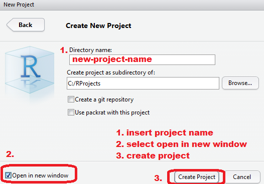
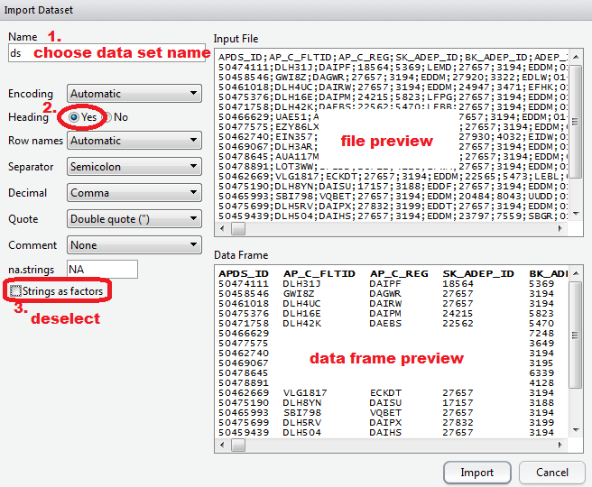

# Chapter 3 Overview

This chapter provides an overview of the operational ANS performance data.

In this initial version focuses on operational ANS performance data at and around airports.

# Description of Data Collection / Analysis Process

to be developed

## Movement Data for Arrivals and Departures

develop description of data set

# Getting Data into R/Rstudio

R has many functions to read in data in a variety of formats.

Throughout this chapter it is assumed that the data set for analysis is either 

* extracted (or constructed) from a database; or 
* made available as an Excel file.

To overcome issues related to Excel in terms of complexity of sheets or formatting, export the data in a simple text format, i.e. csv.
csv files are easily read by a variety of software.

Before starting an analysis, we recommend to set-up a new project in RStudio:

1. select File >> New Project
1. complete the dialogue:        
   New Directory >> Empty Project
1. completing the settings:   
   choose an appropriate project name, e.g. ANSPerfTest   
   select Open in New Window
1. create the new project by clicking *Create Project*.



This opens a new (empty) project workspace in RStudio.
In the Miscellaneous Pane, you will see an empty working directory with an <project-name>.Rproj file.
This files saves some of the basic settings.

Create a new folder making use of the function in the Misc Pane and name this folder **data**.
Store the extracted data file there.

RStudio offers a convenience function to import datasets from text files such as .txt or .csv.

1. Tools >> Import Dataset >> From Textfile
1. browse to the data folder and select the data file
1. the import dialogue allows for the selection of specific settings
  1. choose a data set name
  2. select the appropriates separator (typically comma or semi-colon)
  3. de-select strings as factors
1. inspect the target data frame structure and adapt the settings, if required
1. import the data set



You will see a command like 
'ds <- read.csv2("./data/datafile.csv", stringsAsFactors=FALSE')'.
This reflects the settings in the import dialogue, including the selection of the correct import function. 
In our case *read.csv2()*.
RStudio will also open a data viewer in a new tab of the editor pane.

The loaded data set can be inspected With 'str(ds)'.
Going through the listing of the ds data frame, we observe that the different variables (columns) have been read in as basic data types, such as 

* *chr* character meaning alphanumerical strings
* *int* integer numbers
* *num* float numbers, general numeric data
* *logi* logical values, i.e TRUE and FALSE, or NA

R would have coerced some of the read in characters to so-called factors, if we would have not de-selected the "stringsAsFactors" option. 
The reason for this is that factor values require less memory than strings.
For our initial focus, we suppress the factor creation to reduce complexity of operations on vectors.

One of the characteristic features of operational movement data is that it comes with date-timestamps. These are currently read-in as characters.
In order to support time operations on these timestamps, we need to coerce them into a so-called POSIXct data type.

R offers a respective type-coercion function, 'as.POSIXct()', which we call after defining the format of the date-timestamp with 'strptime()'.

>Note: we demonstrate the base R functionality. The package ansperf will provide convenience functions to mask these operations.

``
`{r read1}
ds$BLOCK_TIME_UTC <- as.POSIXct(strptime(ds$BLOCK_TIME_UTC
                                         , format = "%d-%m-%Y %H:%M:%S"
                                         , tz = "UTC")
                                )
```

# References
