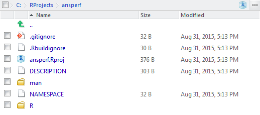

# overview

This is an R Markdown document. Markdown is a simple formatting syntax for authoring HTML, PDF, and MS Word documents. For more details on using R Markdown see <http://rmarkdown.rstudio.com>.

When you click the **Knit** button a document will be generated that includes both content as well as the output of any embedded R code chunks within the document. You can embed an R code chunk like this:

```{r}
summary(cars)
```

## a plot

You can also embed plots, for example:

```{r, echo=FALSE, fig.cap = "Caption defined in chunk options"}
plot(cars)
#$$\label{fig:cool}$$
```



Note that the `echo = FALSE` parameter was added to the code chunk to prevent printing of the R code that generated the plot.

This is now my cross-reference $\ref{fig:cool}$ 

this is a latex example


I can reference to a header; see section [a plot] or go back to the beginning [overview]

Now here comes my cross reference to Figure (@myfig) after i had inserted the index at the end it works.

This is a latex cross link $\ref(fig:mycaption)$.

# Another try

<span id="img:foo-bar"></span>

Taken from: http://pandoc.org/try/?text=%3Cspan+id%3D%22img%3Afoo-bar%22%3E!%5BA+bar+frequented+by+foos%5D(foo-bar)%3C%2Fspan%3E%0A%0A%5BThe+foo+bar%5D(%23img%3Afoo-bar).&from=markdown&to=latex

[The foo bar](#img:foo-bar).


# another example - does not work at all

(#Rconsolefigure)

both versions do not work, using {} and () for the #name

I can now write text that references the [Figure 1](#Rconsolefigure)


# List of index for @caption notation

I need an index of my figures at the end

(@myfig) *Primitive example copied*
